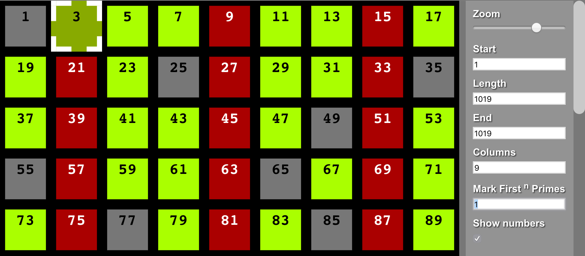

# Prime-Explorer

A visual prime number explorer with html, css and javascript.

[Click here to try it out](https://f1lt3r.github.io/prime-explorer/)

](screen-shot.png)

- Prime numbers from `3` - `9,999,991` are loaded into memory. These numbers can be "marked" (in red) and used to sieve (solve) larger composites (thereby revealing larger primes).
- Note: I don't consider 2 to be a _True Prime_ because it can not be used sieve later primes.
- Also: This code has not optimized for drawing speed. It is using DOM elements, so it's very slow.